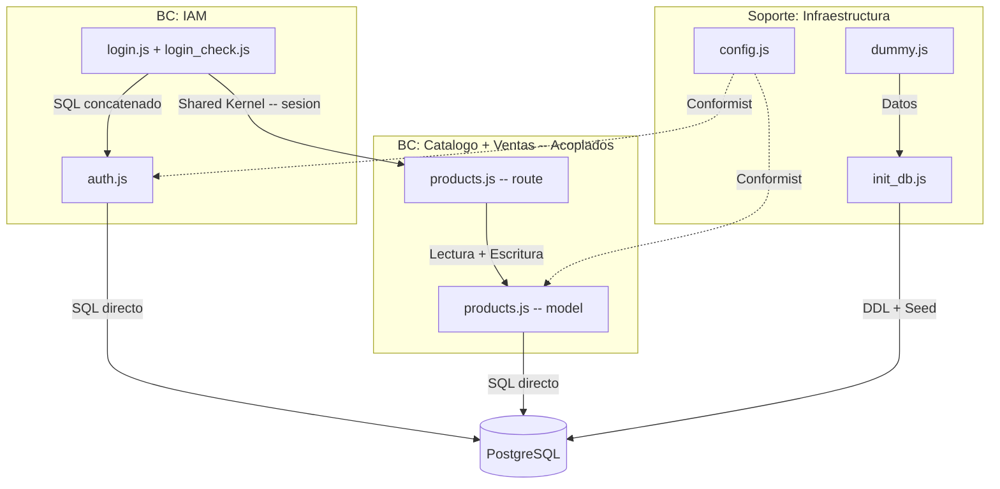
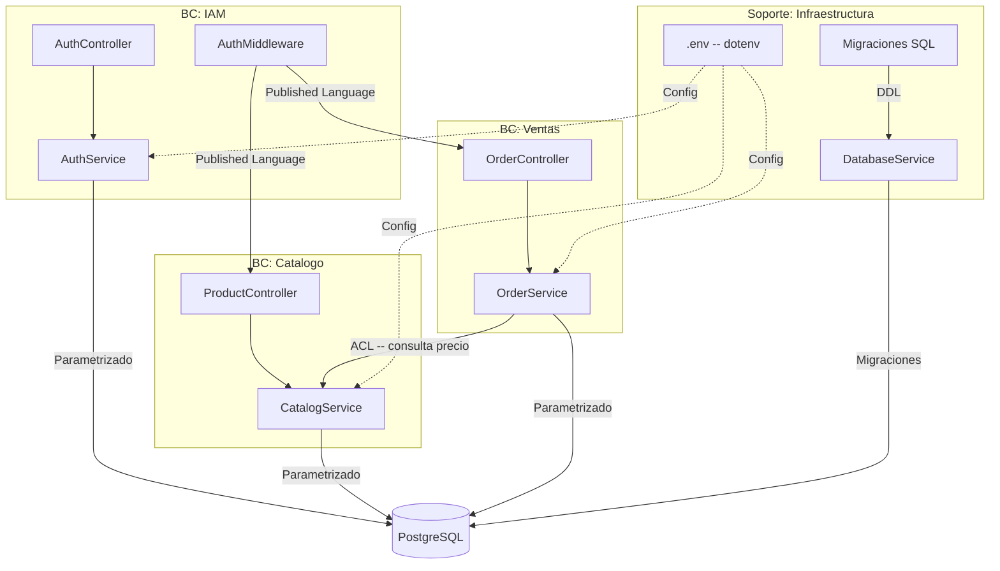

# Context Map -- Vulnerable Node

## 1. Bounded Contexts (Estado Actual)

El sistema opera como un monolito con tres contextos de dominio implicitamente acoplados:

### BC-1: Identity and Access Management (IAM)

Autenticacion de usuarios, gestion de sesiones y control de acceso.
Componentes: `model/auth.js`, `routes/login.js`, `routes/login_check.js`.
Deuda: SQL por concatenacion directa (SQLi), secreto de sesion hardcodeado, credenciales en texto plano, logica de redireccion abierta.

### BC-2: Catalogo de Productos

Listado, busqueda y detalle de productos.
Componentes: `model/products.js` (operaciones de lectura), `routes/products.js` (handlers de lectura).
Deuda: Comparte archivo con el contexto de Ventas (God-Object). Busqueda refleja input sin escape (XSS).

### BC-3: Ventas (Ordenes de Compra)

Procesamiento de compras y registro de transacciones.
Componentes: `model/products.js` (metodo `purchase`), `routes/products.js` (handler `/buy`).
Deuda: Precio proviene del cliente sin validacion server-side. Logica de negocio embebida en el handler HTTP. Insercion SQL sin parametrizar.

### Contexto de Soporte: Infraestructura y Bootstrap

Inicializacion del esquema, seed de datos y configuracion de entorno.
Componentes: `model/init_db.js`, `config.js`, `dummy.js`.
Deuda: Logica de seed invertida (solo inserta en segundo arranque). Esquema DDL acoplado al boot de la aplicacion. IPs hardcodeadas en config.

---

## 2. Relaciones entre Contextos (Estado Actual)

| Upstream | Downstream | Tipo de Relacion | Problema |
|----------|------------|-------------------|----------|
| IAM | Catalogo, Ventas | Shared Kernel | Sesion compartida via cookie sin contrato explicito |
| Infraestructura | IAM, Catalogo, Ventas | Conformist | Los tres contextos dependen de `config.js` y del esquema definido en `init_db.js` sin abstraccion |
| Catalogo | Ventas | (Indistinguible) | Ambos viven en los mismos archivos; no existe frontera |

---

## 3. Bounded Contexts Propuestos (Estado Refactorizado)

Aplicando el patron Strangler Fig, se proponen las siguientes fronteras desacopladas:

### BC-1R: IAM (Refactorizado)

Responsabilidad: Autenticacion, autorizacion y sesion.
Componentes destino: `controllers/AuthController.js`, `middlewares/AuthMiddleware.js`, `services/AuthService.js`.
Cambios clave: Queries parametrizadas, validacion de redirect URL, hash de contraseñas (bcrypt/argon2), middleware de sesion reutilizable.

### BC-2R: Catalogo (Refactorizado)

Responsabilidad: Consulta de productos y busqueda.
Componentes destino: `controllers/ProductController.js`, `services/CatalogService.js`.
Cambios clave: Separacion total del contexto de Ventas. Queries parametrizadas. Sanitizacion de input de busqueda.

### BC-3R: Ventas (Refactorizado)

Responsabilidad: Procesamiento de ordenes de compra e historial.
Componentes destino: `controllers/OrderController.js`, `services/OrderService.js`.
Cambios clave: Validacion de precio server-side contra base de datos. Queries parametrizadas. Contrato explicito con Catalogo via interfaz de servicio (ACL).

### Soporte-R: Infraestructura (Refactorizado)

Responsabilidad: Gestion de esquema, migraciones, seed y configuracion.
Componentes destino: `services/DatabaseService.js`, migraciones SQL externas, `.env` para secretos.
Cambios clave: `CREATE TABLE IF NOT EXISTS` + `ON CONFLICT DO NOTHING`. Seed desacoplado del boot (`npm run seed`). Externalizacion de secretos via dotenv.

---

## 4. Relaciones Propuestas (Estado Refactorizado)

| Upstream | Downstream | Relacion Propuesta |
|----------|------------|---------------------|
| IAM | Catalogo, Ventas | Published Language -- Middleware exporta interfaz de sesion validada |
| Catalogo | Ventas | Anti-Corruption Layer -- Ventas consulta precio real via CatalogService, nunca acepta datos del cliente |
| Infraestructura | Todos | Separate Ways -- Migraciones y seed se ejecutan independientemente del ciclo de vida de la app |

---

## 5. Context Map (Mermaid)

### 5.1 Estado Actual (As-Is)

### 5.2 Estado Propuesto (To-Be)

